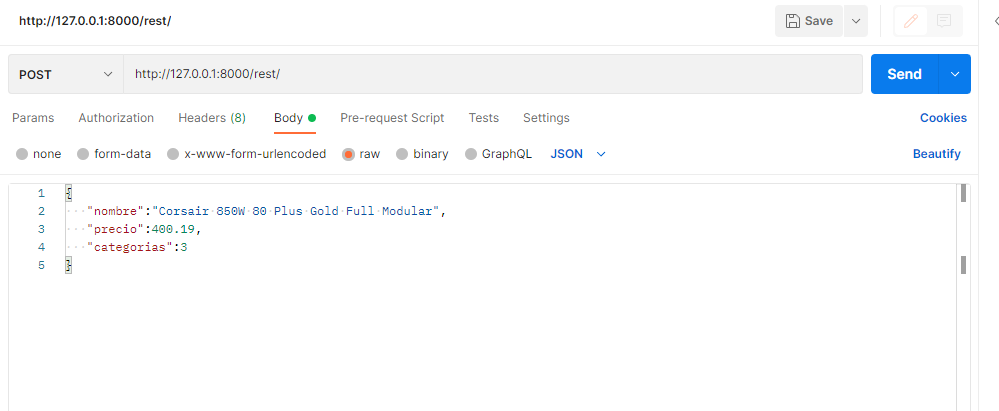
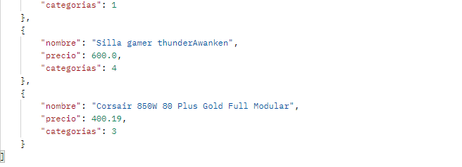

# PW2E-Proyecto-final

<div align="center">
<table>
    <theader>
        <tr>
            <td></td>
            <th>
                <span style="font-weight:bold;">UNIVERSIDAD NACIONAL DE SAN AGUSTIN</span><br />
                <span style="font-weight:bold;">FACULTAD DE INGENIERÍA DE PRODUCCIÓN Y SERVICIOS</span><br />
                <span style="font-weight:bold;">DEPARTAMENTO ACADÉMICO DE INGENIERÍA DE SISTEMAS E INFORMÁTICA</span><br />
                <span style="font-weight:bold;">ESCUELA PROFESIONAL DE INGENIERÍA DE SISTEMAS</span>
            </th>
            <td></td>
        </tr>
    </theader>
    <tbody>
        <tr><td colspan="3"><span style="font-weight:bold;">Formato</span>: Guía de Práctica de Laboratorio</td></tr>
        <tr><td><span style="font-weight:bold;">Aprobación</span>:  2022/03/01</td><td><span style="font-weight:bold;">Código</span>: GUIA-PRLD-001</td><td><span style="font-weight:bold;">Página</span>: 1</td></tr>
    </tbody>
</table>
</div>

<div align="center">
<span style="font-weight:bold;">GUÍA DE LABORATORIO</span><br />
</div>

<table>
<theader>
<tr><th colspan="6">INFORMACIÓN BÁSICA</th></tr>
</theader>
<tbody>
<tr><td>ASIGNATURA:</td><td colspan="5">Programación Web 2</td></tr>
<tr><td>TÍTULO DE LA PRÁCTICA:</td><td colspan="5">Django</td></tr>
<tr>
<td>NÚMERO DE PRÁCTICA:</td><td>07</td><td>AÑO LECTIVO:</td><td>2022 A</td><td>NRO. SEMESTRE:</td><td>III</td>
</tr>
<tr>
<td>FECHA INICIO::</td><td>4-agosto-2022</td><td>FECHA FIN:</td><td>9-agosto-2022</td><td>DURACIÓN:</td><td>04 horas</td>
</tr>
<td>ESTUDIANTES:</td><td colspan ="3"><li>Luis Ayben Chahua Charca</li><li>Luis Fernando Chambi Orosco</li> </td><td>NOTA:</td><td ></td>
</tr>
<tr><td colspan="6">DOCENTES:
<ul>
<li>Richart Smith Escobedo Quispe</li>
</ul>
</td>
</<tr>
</tdbody>
</table>

## 1 EJERCICIO

 Creacion de la API y el cliente que consume la API.
 https://www.django-rest-framework.org/

-modelos de su webapp mediante GET, POST

Mostrar resultados 

 -Navegador web

 -Cliente rest : SOAP UI , Postman,....

 Crear un cliente REST que consuma el servivio implementado 

 1 cliente HTML AJAX 

 2 Cliente form django AJAX

 3 cliente movil que muestre estos datos 

 4 cliente angularJS

## 2 SOLUCION 

primero debemos tener el proyecto y un app despues  instalamos django-rest-framework en el proyecto 
con:
  ````sh
	pip install djangorestframework
  ````
Agregamos la configuración 'rest_framework' dentro de archivo settings.py en la parte de INSTALLED_APPS
 ````sh
	INSTALLED_APPS = [
    ...
    'rest_framework',
]
  ````
 ahora en la archivo models.py creamos un modelo en nuestro caso sera de productos 

   ````sh
from email.policy import default
from django.db import models

class categoriaprod(models.Model):
	nombre=models.CharField(max_length=50)
	create=models.DateTimeField(auto_now_add=True)
	update=models.DateTimeField(auto_now_add=True)
	class Meta:
		verbose_name='categoria'
		verbose_name_plural='categorias'
	def __str__(self):
		return self.nombre
class producto(models.Model):
	nombre=models.CharField(max_length=50)
	imagen=models.ImageField(upload_to='catalogo',null=True,blank=True,default="")
	precio=models.FloatField()
	categorias=models.ForeignKey(categoriaprod, on_delete=models.CASCADE)
	class Meta:
		verbose_name='producto'
		verbose_name_plural='productos'
	def __str__(self):
		return self.nombre
  ````
Crearemos un archivo serialzers.py dentro de la app web1 donde importamos de rest_framework el serializers y tambien de .models deonde llamanos el modelo producto
````sh
from rest_framework import serializers
from .models import producto

class productoSerealizer(serializers.ModelSerializer):
	class Meta:
		model=producto
		fields = ['nombre',"precio","categorias"]
  ````
luego vamos views.py y usaremos un decorador importando 
````sh
	
    from rest_framework.decorators import api_view

  ````
 luego creamos un metodo que tenga las funciones GET y POST 

 ````sh
	
   @api_view(['GET', 'POST'])
def Get_Post_APIView(request):
    if request.method == 'GET':
        get = producto.objects.all()
        get_serializer = productoSerealizer(get, many=True)
        return Response(get_serializer.data)
    elif request.method == 'POST':
        post_serializer = productoSerealizer(data=request.data)
        if post_serializer.is_valid():
            post_serializer.save()
            return Response(post_serializer)
        return Response(post_serializer.errors)

  ````

  luego creamos dentro web1 el archivo urls.py y ponemos :

   ````sh
	
  from .views import Get_Post_APIView
from django.urls import path
urlpatterns = [
    path('rest/', Get_Post_APIView, name="productos_api"),
]

  ````
ahora en la carpeta proyecto incluimos el  archivo urls. py que creamos en urls.py dentro de la carpeta web1
 
   ````sh
	from django.urls import path,include
	path('', include('web1.urls')),
   ````
   Con esto ya habriamos creado los servicion REST con POST Y GET de modelos 
   ahora corramos el servidor 
   ````sh
	 python .\manage.py runserver
   ````
  vamos al dirreccion siguiente para mostrar resulados 
   ````sh
	http://127.0.0.1:8000/rest/
   ````
   
   GET

resultados del navegador 

  (imagen de referencia) 

resultado usando cliente REST : postman 
(imagen de referencia) 

POST

Usamos postman para el POST 

en este caso registraremos un producto 
  (imagen de referencia) 

que vemos que si se registra al final de los demas productos 
(imagen de referencia) 

CLIENTE DE REST
Este cliente se contruyo en una carpeta a parte del proyecto, que consume la data mientras el servidor esta activo.
Para empezar se debe hacer uso de django requests que se instala: 
  ````sh
	pip install request
  ````
Sobra recalcar que dentro del entorno virtual previamente creado.
Una vez hecho esto, se crea el archivo cliente.py

  ````sh
	import requests

  url = 'http://127.0.0.1:8000/rest/'
  data = requests.get(url)
  if data.status_code == 200:
    data = data.json()
    for e in data:
        print(e['nombre'])

  ````

A lo que nos devuelve esto

  ````sh
  ...\cliente REST> python cliente.py
  Xiaomi Redmi 9A 2/32GB Azul Glaciar Libre
  Xiaomi Redmi Note 11 Pro Plus 5G 8/256GB Gris Libr
  Apple iPhone 13 256GB Verde Alpino Libre
  Zotac Gaming GeForce RTX 3080 Ti Trinity OC LHR 12
  Gigabyte GeForce RTX 3060 GAMING OC 12GB GDDR6 Rev
  MSI RTX 3060 TI VENTUS 2X OC V1 LHR 8GB GDDR6
  PlayStation 5 Consola (con ranura de disco)
  Consola Xbox One x 1TB con mando inalámbrico
  Consola PlayStation 4 Pro 1TB Limited Edition - Ma
  Silla gamer thunderAwanken
  Corsair 850W 80 Plus Gold Full Modular
  ````

Que son los datos que la app filtrados por el nombre.  
Para que pueda probarlo usted, simplemente debe activar el servidor e implementar el codigo de cliente.py recordando cambiar el puerto por el que este usando en caso no sea el 8000.

   
## RETROALIMENTACION GENERAL

## REFERENCIAS
https://www.django-rest-framework.org/
https://docs.djangoproject.com/en/4.0/intro/tutorial06/

#

[license]: https://img.shields.io/github/license/rescobedoq/pw2?label=rescobedoq
[license-file]: https://github.com/rescobedoq/pw2/blob/main/LICENSE
[downloads]: https://img.shields.io/github/downloads/rescobedoq/pw2/total?label=Downloads
[releases]: https://github.com/rescobedoq/pw2/releases/
[last-commit]: https://img.shields.io/github/last-commit/rescobedoq/pw2?label=Last%20Commit
[debian]: https://img.shields.io/badge/Debian-D70A53?style=for-the-badge&logo=debian&logoColor=white
[debian-site]: https://www.debian.org/index.es.html
[git]: https://img.shields.io/badge/git-%23F05033.svg?style=for-the-badge&logo=git&logoColor=white
[git-site]: https://git-scm.com/
[github]: https://img.shields.io/badge/github-%23121011.svg?style=for-the-badge&logo=github&logoColor=white
[github-site]: https://github.com/
[vim]: https://img.shields.io/badge/VIM-%2311AB00.svg?style=for-the-badge&logo=vim&logoColor=white
[vim-site]: https://www.vim.org/
[java]: https://img.shields.io/badge/java-%23ED8B00.svg?style=for-the-badge&logo=java&logoColor=white
[java-site]: https://docs.oracle.com/javase/tutorial/

[![Debian][debian]][debian-site]
[![Git][git]][git-site]
[![GitHub][github]][github-site]
[![Vim][vim]][vim-site]
[![Java][java]][java-site]

[![License][license]][license-file]
[![Downloads][downloads]][releases]
[![Last Commit][last-commit]][releases]
